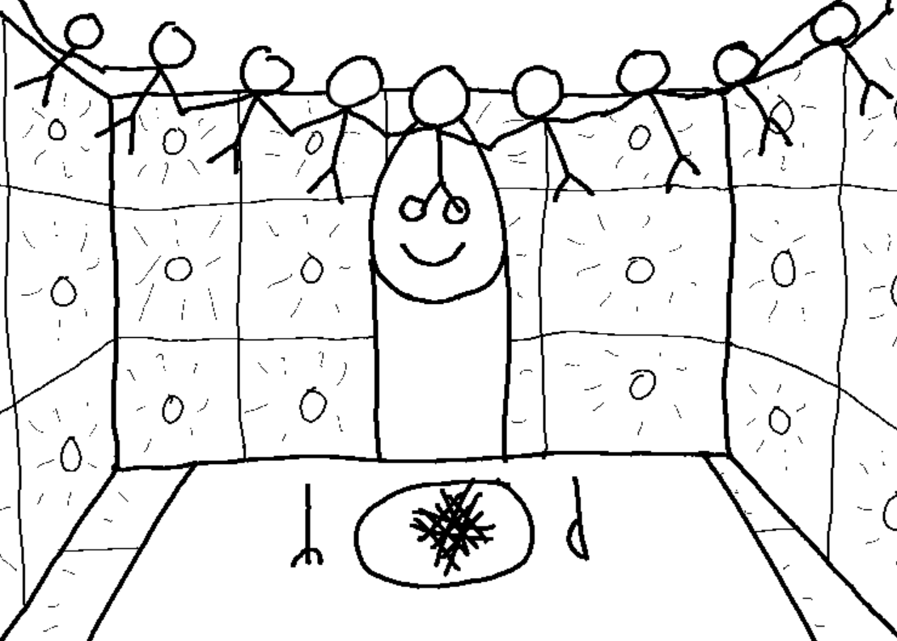

# LinkedList Implementation (forward_list)

## Assignment Description

### Jebediah the Curious



## Problem description

Jebediah is an ambitious computer science student. He has recently took an interest in digital encryption and authentication. Many of these algorithms use hash functions. A hash function is a function which takes a (uniquely identifying and potentially large) input, and generates a (short and manageable) _hash code_. Jebediah has decided that he wants to implement one himself. The algorithm he has decided he wants to use is rather simple and ill suited for serious cryptographic pursuits, but it's a good place
to start.

Jebediah has a problem, however. He needs either a **Linked List** or a **Doubly Linked List** to complete this hash function. You may think Jebediah's goal is attainable without one, but nonetheless he will dock you points if you try to go against his hypothesis.

Implement either a **Linked List** or a **Doubly Linked List** by creating a file called **MyList.hpp**. Look in **MyList.h** for function prototypes that you will implement in **MyList.hpp**. If you want to make your Linked List a Doubly Linked List, simply uncomment the previous node pointer in the ListNode class in **MyList.h**. Do NOT modify anything else in **MyList.h**.

### Inputs

The input will simply consist of lines of integers. There will be one non-negative integer per line and you can assume the integer will have less than a thousand digits.

Example input:

```
1527
1234
8888
592774836483
```

### Outputs

Output, like input, should just consist of lines of integers. Each output line should correspond to the input line, where the outputted line is all of the digits of the input integer added together.

Example output:
```
15
10
32
66
```

Your task will be to replicate the functionality of a std::forward_list as closely as possible in your own class (MyList).

The class you’ll be building along with function definitions can be found in MyList.h, read this file carefully as the operations may not be exactly the same as those discussed in class. You can also refer to [cppreference](https://en.cppreference.com/w/cpp/container/forward_list) for more info on the operations.

Place your code for each of the required functions in MyList.hpp, as always it is recommended that you follow the unit tests as a guide and code each function one-by-one after passing each test.

**Important Note:**
To bring this implementation more in line with std::forward_list and prepare you for working with the standard library implementations directly, some functions have shifted to use an **LinkedListIterator** in place of a normal _pointer_.

The **LinkedListIterator** class provided is designed to act similar to a _ListNode_ pointer.
* It returns a reference to the underlying node when de-referenced
* It can be advanced forward _i_ nodes with addition **(iter+1 ; iter+i)**
* It can be used to access member variables **(iter->data ; iter->next)**

## Scoring:

To get full points on the assignment...
* Implement each function in the _MyList_ class **(unit_tests)**
* Fix any memory leaks or invalid memory operations **(mem_tests)**
* Implement _main.cpp_ as specified above
* Address any warnings given by cppcheck **(static analysis)**
* Format your code using the clang-format utility **(style check)**
